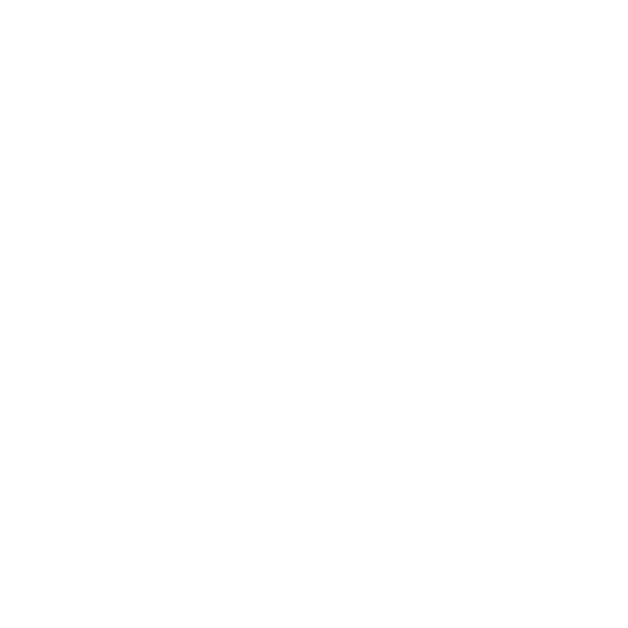
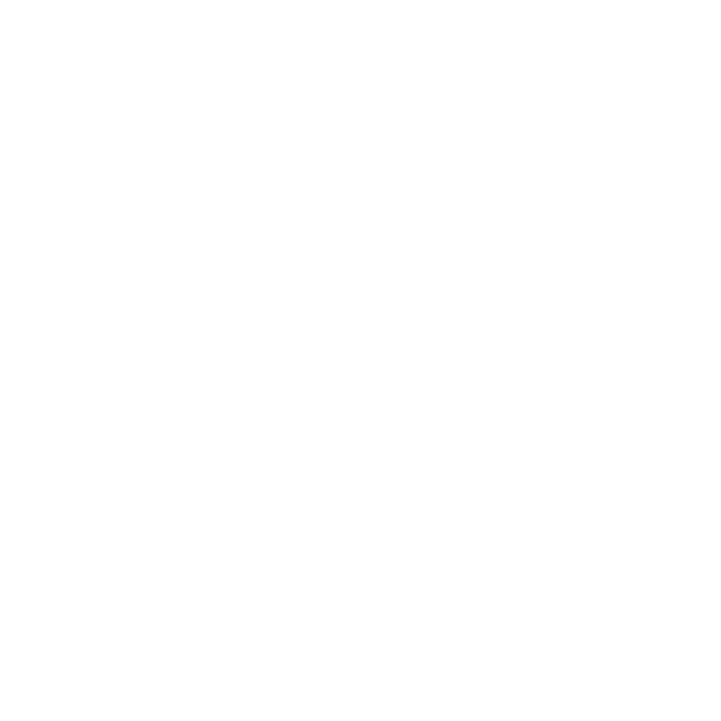

  <h2>Hello there, I'm Mathews </h2>

  I'm a Student, Software Engineer | Web Developer | Artist | Single

 
 
 
<h3 style="font-family: 'General Sans', sans-serif;font-size: 20px;">About Me
<picture>
  <source srcset="https://fonts.gstatic.com/s/e/notoemoji/latest/1f60e/512.webp" type="image/webp">
  
</picture></h3>
 
<ul style="list-style-type: none; padding: 0;">
  <li>🙋🏻‍♂️ I'm a Software Engineer with a passion for coding and problem-solving.</li>
  <li>🌱 Currently working as a Front-end Developer specializing in the MERN stack.</li>
  <li>🎓 B.Tech in Engineering.</li>
  <li>💼 Focused on building innovative web solutions that drive business success.</li>
  <li>🌐 Continuously exploring the latest in front-end frameworks and web technologies.</li>
  <li>🧪 Experimenting with backend development and other tech stacks to expand my skill set.</li>
  <li>🏓 A big fan of anime and always up for a good series recommendation!</li>
  <li>⚡ Fun fact: I thrive on coding challenges and am always eager to learn about new technologies!</li>
</ul>
 

 
<h3 style="font-family: 'General Sans', sans-serif;font-size: 20px;">Languages and Tools
  <picture>
    <source srcset="https://fonts.gstatic.com/s/e/notoemoji/latest/1f680/512.webp" type="image/webp">
    
  </picture>
</h3>
 

  
  
  
  
  
  
  
  
  
  
  
  
  
  
  
  
  
  
  

 
 
<h3 style="font-family: 'General Sans', sans-serif;font-size: 20px;">My Coding Journey 
<picture>
  <source srcset="https://fonts.gstatic.com/s/e/notoemoji/latest/1f331/512.webp" type="image/webp">
  
</picture>
</h3>
 

  
Click to expand

  

    As a B.Tech graduate from the 2019-2023 batch, my path into coding took a somewhat unconventional route. While programming was a part of my early engineering studies, it wasn't until my fourth year that I truly began to dive into it.
    Initially, my academic focus was spread thin over various subjects, with coding merely an undercurrent in my educational stream. However, as I approached my final year, the pressure of securing a job and shaping a career led me to the path of programming.

    The COVID-19 pandemic, however, cast a shadow over my initial foray into this field. The disruptions caused by remote learning felt like navigating through a foggy landscape, leaving me disoriented and demotivated. My involvement with studies and coding dwindled, resulting in a period of frustration where everything seemed like watching paint dry or grass grow. Remote learning and the shift to online platforms presented their own challenges, but they also offered a chance to adapt and cultivate resilience.

    After graduation, I dove deeper into coding, yet I found myself caught in the trap of endless tutorials, a cycle I later recognized as "tutorial hell." During this phase, I invested two months mastering React and enrolled in a Python internship course in Trivandrum. Unfortunately, the course turned out to be a scam, consuming eight months of my time. Determined to reclaim my path, I redirected my focus to the MERN stack, and this shift paid off. As I write this, I am proud to be embarking on my first MERN stack internship job.

    Despite the obstacles, this journey has been transformative. The hurdles faced along the way have shaped my approach to problem-solving and continuous learning in the ever-evolving tech landscape. For me, coding is more than just a profession—it's an escape from reality and a way to turn the wheels of time. Though coding can sometimes seem monotonous, the challenges and satisfaction of reaching a solution are incomparable. Each piece of work is a craft, a creation from nothing, and this is where I find my pursuit of happiness.

  

 
 

<!-- 

 -->

 
<h3 style="font-family: 'General Sans', sans-serif;font-size: 20px;">Connect with Me
  <picture>
    <source srcset="https://fonts.gstatic.com/s/e/notoemoji/latest/1f601/512.webp" type="image/webp">
    
  </picture>
</h3>
 

  
  
  
  
  

 
 
 

  <h3>
    <picture>
      <source srcset="https://fonts.gstatic.com/s/e/notoemoji/latest/1f4aa/512.webp" type="image/webp">
      
    </picture>
    Checkout my rookie code 👇🏻
  </h3>

 
 
<!--
**Mathews-Gigi/Mathews-Gigi** is a ✨ _special_ ✨ repository because its `README.md` (this file) appears on your GitHub profile.

Here are some ideas to get you started:

- 🔭 I’m currently working on ...
- 🌱 I’m currently learning ...
- 👯 I’m looking to collaborate on ...
- 🤔 I’m looking for help with ...
- 💬 Ask me about ...
- 📫 How to reach me: ...
- 😄 Pronouns: ...
- ⚡ Fun fact: ...
  -->
